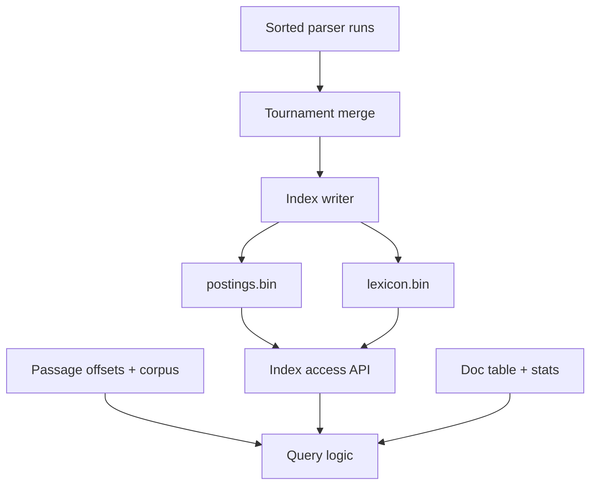

# System Architecture

## Overview
The search engine is split into three separate executables that communicate through files on disk:
1. `parser`: Reads raw passages, tokenizes, and outputs sorted intermediate run files + document metadata.
2. `indexer`: Merges intermediate runs and builds the final compressed inverted index.
3. `query`: Interactive query interface that runs DAAT search and BM25 ranking.

---

## 1. Parser (Executable 1)

### What it does
- Streams `collection.tsv` line-by-line using buffered I/O.
- Line format: `passage_id \t passage_text`.
- Assigns continuous doc IDs starting from 0 (`doc_id = 0, 1, 2, ...`).
- Cleans and tokenizes text:
  - Lowercase all words.
  - Split on non-alphanumeric characters (UTF-8 safe).
  - Filter out terms with length < 2 or > 30, and terms with more than 5 digits.
- Counts term frequency for each document.
- Accumulates postings `(term, doc_id, freq)` in a memory buffer.
- When buffer is full (e.g. ~5 million postings), sorts the buffer by `term` ASC then `doc_id` ASC, and writes out a sorted run file (`run_XXX.tsv`).
- Emits document table, collection stats, and passage byte offsets.

### Output Files (Handoff to Indexer)

All output files are written to `data/runs/` and `data/index/`.

#### 1. Intermediate Runs (`data/runs/run_XXX.tsv`)
- TSV format, sorted primary by `term` (alphabetical A-Z), secondary by `doc_id` (ascending).
- Schema:
  ```tsv
  term<TAB>doc_id<TAB>term_freq
  ```
- Example:
  ```tsv
  algorithm	12	2
  algorithm	45	1
  apple	3	1
  apple	14	4
  banana	8	2
  ```

#### 2. Document Table (`data/index/doc_table.tsv`)
- Maps internal `doc_id` to external MS MARCO passage ID and doc token length (needed for BM25).
- Schema:
  ```tsv
  doc_id<TAB>external_passage_id<TAB>doc_len
  ```
- Example:
  ```tsv
  0	8234125	48
  1	194821	72
  ```

#### 3. Collection Stats (`data/index/collection_stats.json`)
- Global numbers needed for BM25 calculation:
  ```json
  {
    "total_docs": 8841823,
    "total_tokens": 523912041,
    "avg_doc_len": 59.25
  }
  ```

#### 4. Passage Byte Offsets (`data/index/passage_offsets.bin`)
- Binary array of `u64` little-endian file byte offsets into `collection.tsv`.
- Offset for doc `i` is stored at byte index `i * 8`.
- Lets the query engine do $O(1)$ seeks into `collection.tsv` to grab raw passage text for snippets.

---

## 2. Indexer (Executable 2)

The index layer has two implementations that share the same binary format:

- **Offline writer (`indexer`)**: Builds the compressed postings and lexicon, then exits.
- **Reader library (serves `query`)**: Navigates postings and serves user searches.

### What it does



### Memory Design


| Phase | RAM bound | Disk access |
|---|---|---|
| Build | One buffer and tree row per active run, plus one chunk and bounded output/directory buffers | Stream runs and output; spill large directories temporarily. |
| Reader startup | One sample per 64 lexicon terms, shared by all cursors | Read only the sample table. |
| Each open cursor | Term metadata, position, and at most one decoded 64-posting chunk—up to 512 bytes for two `u32` arrays, plus cursor overhead | Read one lexicon group on open; read directory entries and posting chunks as seeks require. |

At startup, the reader loads only the sparse samples into a sorted shared array. Samples store the first term and lexicon byte offset of every 64-entry group; sampled term bytes may share one buffer. `openList()` reads at most one 64-entry term group, and `nextGEQ()` replaces the cursor's decoded chunk as it moves. No complete posting list or large directory is retained. For example, 1 million terms produce 15,625 RAM samples, not 1 million resident lexicon entries. The 512-byte figure covers decoded ID and frequency arrays only, not total cursor allocation.

### Inverted Index

- **Merge:** A tournament tree merges buffered, sorted `run_XXX.tsv` files by `(term, doc_id)`. Configurable fan-in permits additional passes when there are too many runs to open at once.
- **Validate:** Reject malformed or unsorted input, invalid doc IDs or frequencies, and every duplicate `(term, doc_id)`. During reads, reject unknown versions/codecs, invalid offsets/counts, truncation, nonzero padding, and non-increasing real doc IDs. Validate decoded postings and `nextGEQ()` against small known lists; publish final files only after all validation succeeds.
- **Encode:** Write ascending doc IDs in term-owned chunks with a configurable capacity, initially 64. Pad the final chunk with zero slots and record its real posting count. Bit-pack doc-ID gaps and frequencies in separate sections; gaps restart from zero in each chunk. Store neither positions nor impacts.
- **Navigate:** Append a directory after each term's chunks. Its last-doc-ID and byte-offset entries let `nextGEQ()` skip earlier chunks without decoding them.

Padding makes every chunk use the same 64-value decoding path, but short lists can consume much more space. Measure bytes spent on singleton and other short lists before claiming a compression advantage.

#### `postings.bin` contract

All multibyte fields are little-endian. The fixed 12-byte header is included in absolute file offsets: `magic:[u8;4]` (`POST`), `version:u16` (`1`), `header_bytes:u16` (`12`), `chunk_capacity:u16` (initially `64`), `reserved:u16` (`0`).

For each term, the byte order is `[chunk 0 ID section][chunk 0 frequency section] ... [chunk directory]`. Every section starts with a `u8` bit width; values are packed least-significant bit first, with unused final-byte bits set to zero. Width zero represents an all-zero section. Padded slots are not postings. The default capacity is 64; rebuilt indexes may record another capacity.

Each directory entry is 24 bytes:

| Field | Type | Meaning |
|---|---|---|
| `last_doc_id` | `u32` | Last real doc ID in this chunk; increases across the term's chunks. |
| `chunk_offset` | `u64` | Absolute offset of the chunk's ID section in `postings.bin`. |
| `posting_count` | `u16` | Real postings in this chunk, from 1 through the recorded capacity. |
| `codec`, `reserved` | `u8`, `u8` | Codec 1 is a bit-packed chunk; codec 0 is reserved; reserved is zero. |
| `id_bytes`, `freq_bytes` | `u32`, `u32` | Encoded section lengths, including their width bytes. |

The frequency section starts at `chunk_offset + id_bytes`; the chunk ends at `chunk_offset + id_bytes + freq_bytes`. All offsets include the file header.

### Term Lexicon

- `lexicon.bin` has one entry per distinct term, sorted in the parser's defined term order, plus a header containing the total term count. An absent term has no entry.

| Field | Type | Meaning |
|---|---|---|
| `term_byte_len`, term bytes | `u16`, UTF-8 bytes | Exact parser term. |
| `doc_freq` | `u32` | Number of distinct matching documents; BM25's $f_t$. |
| `chunk_count` | `u32` | Number of chunks in this list. |
| `first_chunk_offset` | `u64` | First chunk in `postings.bin`. |
| `directory_offset` | `u64` | First directory record immediately after this term's chunks. |

`lexicon.bin` stores terms in the parser's defined order and samples the first term and byte offset of every 64-entry group. Each sample entry is `sample_term_byte_len:u16`, `sample_term_utf8:bytes`, `group_offset:u64`.

Its fixed 32-byte header is included in absolute file offsets: `magic:[u8;4]` (`LEXI`), `version:u16` (`1`), `header_bytes:u16` (`32`), `chunk_capacity:u16` (initially `64`), `reserved:u16` (`0`), `sample_interval:u32` (`64`), `sample_table_offset:u64`, `sample_count:u32`, `term_count:u32`.

### Output API

The index access API reads only the two indexer files. Query logic supplies document metadata and corpus text, computes BM25, ranks results, and selects snippets.

| Function | Output | Semantics |
|---|---|---|
| `openList(term)` | `Option<Cursor { doc_freq: u32 }>` | Bind an independent cursor to `term`; `None` means absent. |
| `nextGEQ(target_doc_id)` | `Option<doc_id>` | `Some(id)` for the first real ID ≥ target; `None` exhausts the cursor. Uses directory-guided chunk decoding. |
| `getScore()` | `Result<u32, CursorStateError>` | Return current cursor-internal `tf`; no advance, BM25, or stored impact. Invalid before positioning or after exhaustion. |
| `closeList()` | `()` | Release cursor state. |


### Concurrency

The completed index is immutable. Multiple independent cursors may run concurrently: for example, one worker can advance a `dog` cursor while another advances a `cat` cursor. Each cursor owns its current doc ID and decoded-chunk state, and reads the shared `postings.bin` through independent offsets.

Operations on one cursor are serialized. Two workers must not call `nextGEQ()` or `getScore()` concurrently on the same `dog` cursor; if they need independent `dog` traversals, they must open two cursors. Lexicon and format metadata are shared read-only, and any posting cache is bounded and synchronized. The caller schedules concurrency.

---

## 3. Query Processor (Executable 3)
*(TInverted Index API, DAAT AND/OR query traversal, BM25 ranking, and CLI)*
